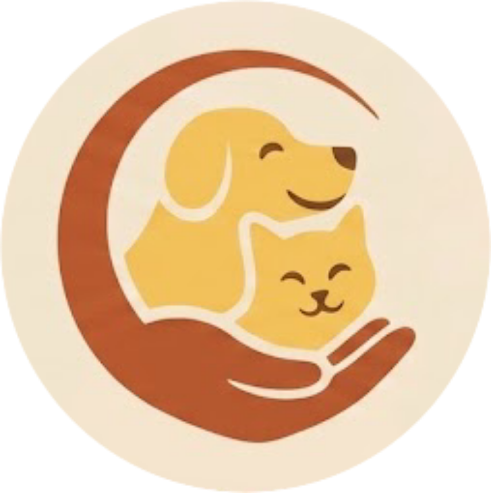

<div align="center">



# PetHood - Cliente

**Clientes de la API de Pethood. Cuenta con app móvil de usuario y panel de administración web**

[](https://github.com/ncorrea-13/Pethood-frontend/actions/workflows/ci.yml)
[](https://nodejs.org)
[](https://expo.dev)
[](https://nextjs.org)
[](https://www.typescriptlang.org)
[](https://tailwindcss.com)
[](#licencia)

</div>

---

Cuenta con dos apps cliente que consumen la misma API REST del backend ([`pethood-backend`](https://github.com/ncorrea-13/Pethood-backend)):

| App                                    | Stack                                 | Estado        |
| -------------------------------------- | ------------------------------------- | ------------- |
| [`apps/mobile/`](apps/mobile/)         | Expo SDK 57 + TypeScript + NativeWind | En desarrollo |
| [`apps/web-admin/`](apps/web-admin/)   | Next.js 15 + Tailwind CSS             | En desarrollo |
| [`packages/shared/`](packages/shared/) | Tipos, cliente API, validaciones Zod  | Placeholder   |

Proyecto académico - UTN Regional Mendoza, Ingeniería en Sistemas de Información

## Quick Start

```bash
# 1. Clonar
git clone https://github.com/ncorrea-13/Pethood-frontend.git
cd Pethood-frontend

# 2. Mobile (la app con código real)
cd apps/mobile
npm ci
npx expo start --clear
# → Escanear QR con Expo Go o levantar emulador
```

Guía completa de entorno (Node 22, troubleshooting, `.env`) en [`apps/mobile/README.md`](apps/mobile/README.md).

## Stack

| Capa           | Mobile                                  | Web-admin            |
| -------------- | --------------------------------------- | -------------------- |
| Runtime        | Node.js 22                              | Node.js 22           |
| Framework      | Expo SDK 57                             | Next.js 15           |
| Lenguaje       | TypeScript (strict)                     | TypeScript (strict)  |
| Estilos        | NativeWind (Tailwind para RN)           | Tailwind CSS 4       |
| Navegación     | Expo Router                             | App Router (Next.js) |
| Almacenamiento | expo-secure-store (tokens)              | -                    |
| Cámara         | expo-image-picker (nativa, obligatoria) | -                    |

## Estructura del Proyecto

```
apps/
├── mobile/              # Expo Router - app para adoptantes y refugios
│   ├── app/             # Pantallas (Expo Router file-based)
│   ├── components/      # Componentes reutilizables
│   ├── constants/       # Tokens de diseño, colores
│   ├── shared/          # Validaciones, helpers
│   └── assets/          # Imágenes, fuentes
├── web-admin/           # Next.js App Router - panel administrativo
│   └── src/
│       ├── app/         # Páginas (App Router)
│       ├── components/
│       ├── services/
│       └── types/
└── shared/              # Tipos, cliente API y validaciones compartidas
    ├── types/
    ├── api/
    └── validations/
```

## Comandos

```bash
# Mobile
cd apps/mobile && npx expo start          # Dev server (Expo Go / emulador)
cd apps/mobile && npx expo start --web    # Versión web (debug)

# Web-admin (cuando exista código)
cd apps/web-admin && npm run dev          # http://localhost:3000
```

## Documentación

Las convenciones de desarrollo (pantallas, reglas de negocio, componentes) están en [`CLAUDE.md`](CLAUDE.md). Los documentos rectores del proyecto completo viven en el [servidor](https://github.com/ncorrea-13/Pethood-backend):

| Documento         | Contenido                           |
| ----------------- | ----------------------------------- |
| `CONSTITUTION.md` | Principios no negociables           |
| `REQUISITOS.md`   | Requisitos funcionales por módulo   |
| `MODELO_DATOS.md` | Entidades, atributos y relaciones   |
| `ROADMAP.md`      | Plan de desarrollo por fases        |
| `ARQUITECTURA.md` | Árbol de directorios y convenciones |
| `specs/`          | Specs aprobadas por módulo          |

## Equipo

Proyecto académico - **UTN Regional Mendoza**, Ingeniería en Sistemas.

- Camila Fabián
- Agustín Leyes
- Nicolás Correa
- Matías Hansen
- Juan Ignacio Castro
